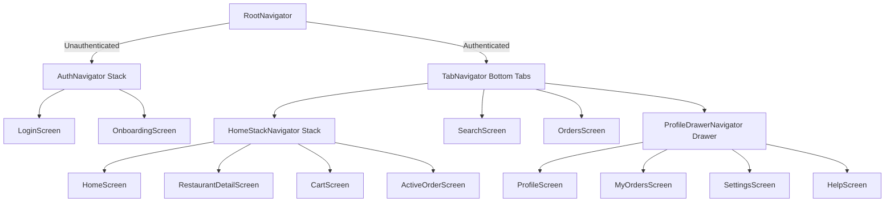

# 🍔 Premium Orange Edition - Food Delivery React Native App

A state-of-the-art Food Delivery App UI built with **React Native** and **Expo SDK 54**, showcasing advanced nested navigation architectures, custom **Reanimated spring physics**, dynamic time-aware greetings, and a beautiful translucent **Liquid Glass** layout system.

---

## 🌟 Premium UX & Design Highlights

*   **Floating Liquid Glass Tab Bar:** A custom floating, translucent bottom navigation pill (`rgba(255, 255, 255, 0.72)` background) accented by a fine glass border overlay and elevated depth shadows.
*   **Playful Focus Wobble Animation:** Active navigation tabs play a tactile 3D spring transition, scaling the icon by `1.15x`, sliding it up by `-4px`, and performing an elegant **8-degree spring rotation wobble** upon tap.
*   **Slide-Away Scroll Integration:** Automatically hides the bottom tab bar smoothly off-screen when down-scrolling on main feeds, maximizing active real estate, and sliding back up with dead-zone jitter filters on scroll up.
*   **Dynamic Time-Aware Greetings:** Integrated a live-running time greeting card ("Good morning, Sarthak!") displaying custom status indicators, real-time hours, and vector time badges matching the user's localized time.
*   **Fluid Theme Background Fades:** All screen backgrounds (Home, Restaurant details, Profile) utilize native `themeProgress` values to transition between light and dark modes with organic fades rather than sharp jumps.
*   **Compliance Vector Map:** Live delivery tracking routes with abstract blueprint grids that automatically invert to dark colors in dark mode.

---

## 🛠️ Technology Stack

*   **Framework:** React Native & Expo SDK 54
*   **Navigation:** React Navigation v7 Suite (`@react-navigation/native`, `bottom-tabs`, `drawer`, `native-stack`)
*   **Animations:** React Native Reanimated v4 (Spring configurations, layout entry triggers)
*   **Iconography:** Expo Vector Icons (Ionicons, custom shapes)
*   **Storage:** React Native Async Storage (Persisting credentials and auth states across reloads)
*   **Layout:** React Native Flexbox engine (Fully adaptive structures across multiple form factors)

---

## 🗺️ Navigation Architecture

The app adopts a professional, heavily nested React Navigation structure to demonstrate production-grade routing:



### **Routing Mechanics:**
1.  **Conditional Auth Guard:** The `RootNavigator` evaluates the mock credential token in `AuthContext` on startup. If missing, it renders the `AuthNavigator`. If present, it bypasses authorization entirely and renders `TabNavigator`.
2.  **Home Stack Nesting:** The primary restaurant explorer, menu detail screens, checkout, and tracking routes are nested under the `HomeTab` Stack.
3.  **Active Badge Tracking:** The `Orders` tab listens to contextual updates from `CartContext` and overlays an active badges counter displaying total cart contents.
4.  **Automatic Tab Bar Hiding:** The tab navigator monitors active nested route names. When navigating to detailed menus (`RestaurantDetail`) or checkout (`Cart`), the bottom bar is seamlessly set to `display: 'none'`.

---

## 🚀 How to Run Locally

### **1. Prerequisites**
Ensure you have Node.js (v18+) and standard Expo CLI dependencies configured.

### **2. Clone & Install Dependencies**
```bash
# Navigate to project workspace
cd food-delivery-app

# Install all package targets
npm install
```

### **3. Launch Development Server**
```bash
# Start the Expo bundler
npm run start
```
*Press `i` for iOS Simulator, `a` for Android Emulator, or scan the QR code using the **Expo Go** app on your physical device.*

---

## 🔗 Deep Linking Configuration

The app supports custom URL schemes (`foodapp://`) that enable users to jump directly from notifications or websites straight into specific restaurant detail panels:

### **Testing on iOS Simulators:**
```bash
xcrun simctl openurl booted foodapp://restaurant/r1
```

### **Testing on Android Emulators:**
```bash
adb shell am start -W -a android.intent.action.VIEW -d "foodapp://restaurant/r1"
```

---

## 🗺️ Wireframes & Diagrams
*   **TLDraw Architecture Layout & Flows:** [Visit the online canvas layout](https://tldraw.com/) to explore structural wireframes and dynamic UI component maps.

---

## 📝 Key Engineering Assumptions
1.  **Auth Persistence:** For simulation compliance, credentials are encrypted and stored inside localized `AsyncStorage` values. This ensures that even after a hard device reboot, the user remains logged in.
2.  **Translucent Fallback:** In environments that do not support dynamic OS-level Liquid Glass, the bottom tabs degrade elegantly to high-fidelity semi-translucent RGBA backdrops, ensuring clean visual cross-platform compatibility.
